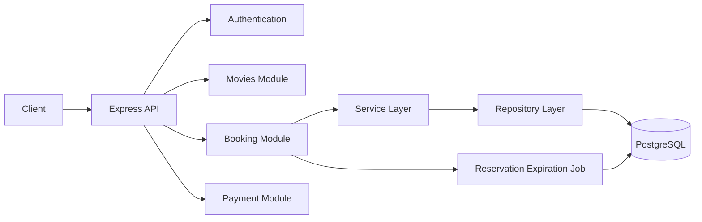
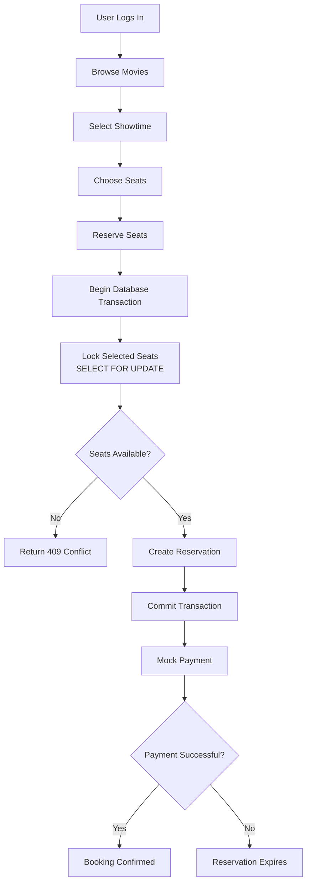
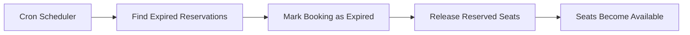
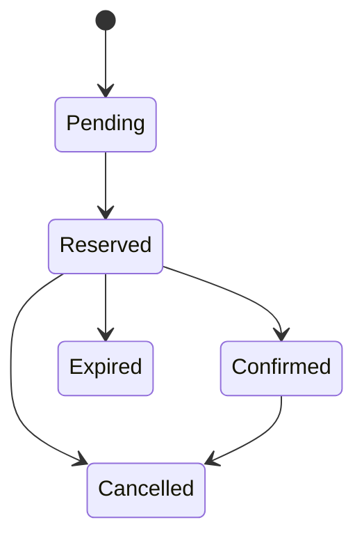
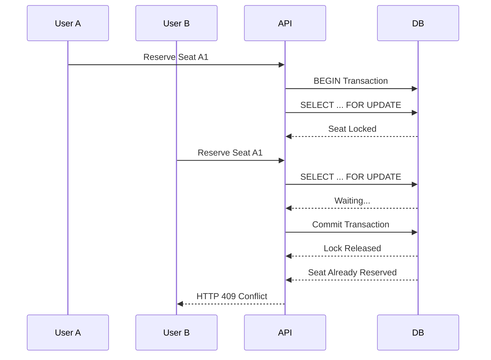

---

# 🎯 Project Goals

This project is intentionally **backend-first** Movie booking system it demonstrates the engineering practices used to build reliable, production-ready booking systems.

### Key Concepts Demonstrated

- 🔒 ACID Transactions
- ⚡ Concurrency Control
- 🪑 PostgreSQL Row-Level Locking
- ♻️ Idempotent APIs
- 🔄 Booking State Machine
- ⏳ Background Job Processing
- 🌐 RESTful API Design
- 🏗️ Layered Backend Architecture
- 🗄️ Relational Database Modeling

---

# 🏗️ System Architecture



The application follows a layered architecture that separates routing, business logic, database access, and background jobs, making the codebase easier to maintain and test.

---

# 🎟️ Booking Flow



Every reservation is processed inside a single database transaction to ensure atomicity and prevent inconsistent seat allocation.

---

# ⏳ Reservation Expiration

Seats are held for a limited time. If payment is not completed before the reservation expires, a scheduled background job automatically releases the seats.



This prevents abandoned reservations from permanently blocking seat availability.

---

# 🔄 Booking State Machine



Booking status transitions are managed exclusively by the backend, ensuring invalid state changes cannot occur.

---

# 🔒 Concurrency Control

The booking engine uses PostgreSQL transactions together with **row-level locking (`SELECT ... FOR UPDATE`)** to prevent two users from reserving the same seat simultaneously.



This guarantees that only one successful reservation can be created for a given seat, even when multiple users attempt to book it concurrently.

# Idempotent Booking Requests

Every reservation request includes an **Idempotency Key**.

If a client retries the same request because of:

- Network failure
- Browser refresh
- Timeout
- Mobile reconnect

the backend returns the original booking instead of creating duplicates.

```text
POST /bookings/reserve

Idempotency-Key:
4d17f9f0-a02d...
```

---

# Reservation Rules

Every reservation follows the same flow:

1. Begin database transaction
2. Lock requested seats
3. Validate availability
4. Check idempotency key
5. Create booking
6. Reserve seats
7. Commit transaction

If any step fails, the transaction rolls back automatically.

---

# Database Schema

The booking engine is intentionally normalized.

```text
users

movies

theaters

screens

seats

showtimes

bookings

booking_seats

seat_holds

payments
```

Foreign keys and unique constraints enforce correctness at the database level.

---

# API Overview

## Authentication

```
POST /auth/register

POST /auth/login
```

---

## Movies

```
GET /movies

GET /showtimes

GET /showtimes/:id/seats
```

---

## Booking

```
POST /bookings/reserve

POST /bookings/:id/confirm

POST /bookings/:id/cancel

GET /bookings/me
```

---

## Payment

```
POST /payments/mock/confirm
```

---

## Admin

```
Manage Movies

Manage Theaters

Manage Screens

Manage Showtimes
```

---

# RBAC

Only two roles are used.

| Role | Permissions |
|-------|-------------|
| Customer | Browse movies, reserve seats, payments, bookings |
| Admin | Manage movies, theaters, screens, showtimes |

---

# Folder Structure

```text
src
│
├── config
├── middleware
├── jobs
├── repositories
├── services
├── utils
│
├── modules
│   ├── auth
│   ├── movies
│   ├── showtimes
│   ├── bookings
│   └── payments
│
├── tests
└── migrations
```

---

# Validation & Error Handling

The API returns consistent HTTP responses.

| Status | Meaning |
|---------|----------|
| 200 | Success |
| 201 | Created |
| 401 | Unauthorized |
| 403 | Forbidden |
| 404 | Resource Not Found |
| 409 | Seat Already Reserved |
| 422 | Validation Error |
| 500 | Internal Server Error |

All errors follow a consistent JSON structure.

---

# Local Development

## Clone

```bash
git clone https://github.com/<username>/movie-ticket-booking.git
```

---

## Install

```bash
npm install
```

---

## Environment

```env
DATABASE_URL=

JWT_SECRET=

PORT=
```

---

## Start Database

```bash
docker compose up -d
```

---

## Run Migrations

```bash
npx prisma migrate dev
```

---

## Start Server

```bash
npm run dev
```

---

# Future Improvements

- Real Payment Gateway Integration
- Redis Distributed Locking
- WebSocket Seat Updates
- Email Notifications
- Ticket QR Codes
- Booking Analytics Dashboard
- Horizontal Scaling
- Load Testing

---

# What This Project Demonstrates

This project focuses on backend engineering concepts frequently discussed in software engineering interviews.

✅ JWT Authentication

✅ RBAC

✅ REST API Design

✅ PostgreSQL

✅ ACID Transactions

✅ Row-Level Locking

✅ Idempotent APIs

✅ Booking State Machine

✅ Background Jobs

✅ Database Normalization

✅ Docker

✅ Production-Oriented Backend Architecture

---

# Resume Highlights

- Architected a backend-first movie ticket booking platform using **Node.js**, **Express.js**, **PostgreSQL**, **JWT**, and **RBAC**, delivering REST APIs for authentication, movie scheduling, seat reservation, booking management, and mock payment confirmation.

- Designed a concurrency-safe booking engine using **PostgreSQL ACID transactions**, **row-level locking**, **idempotency keys**, explicit booking state transitions, and automatic reservation expiration to prevent duplicate seat allocation under concurrent traffic.

- Built a normalized relational schema with foreign keys, composite indexes, centralized validation, structured logging, Dockerized deployment, and layered architecture for production-ready maintainability.

---

## ⭐ Why this project?

Most portfolio projects demonstrate CRUD operations.

This project goes beyond CRUD by implementing the reliability guarantees expected from real-world booking systems—handling concurrent seat reservations correctly, preventing duplicate bookings, and maintaining data consistency through transactions, locking, idempotency, and controlled state transitions.
